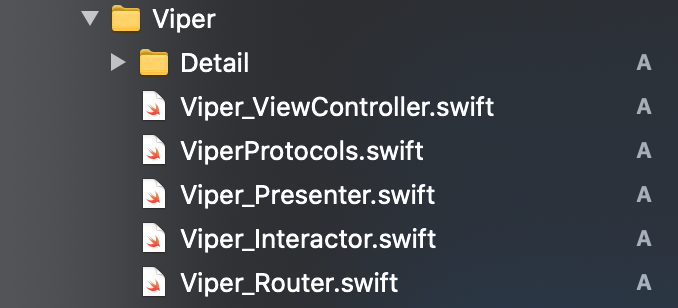

# Arquiteturas

O objetivo desse repositório é a compreensão e entendimento de multiplas arquiteturas no desevolvimento de aplicações iOS.

### Arquiteturas usadas

- MVVM 
- MVC 
- MVP 
- Viper

### Links

- https://medium.com/flawless-app-stories/the-best-architecture-for-ios-app-does-it-even-exist-3af357ac62e7

## MVVM

### Links
- https://medium.com/flawless-app-stories/mvvm-in-ios-swift-aa1448a66fb4
- https://www.toptal.com/ios/swift-tutorial-introduction-to-mvvm

### Como funciona?

É divido em 3 partes:
- Model
- View (ViewController + View)
- ViewModel

#### Model

- Responsável pelos dados

#### ViewModel

- Responsável por injetar e modificar a View, contem as regras de negócio, e pode ser responsável também pelas requests, mas é opcional.

#### View

- Responsável pelos elementos de ui. A ViewController pode ser responsável pelas requests, mas é opcional.

### Estrutura no projeto

## MVC

### Links
- https://www.raywenderlich.com/1000705-model-view-controller-mvc-in-ios-a-modern-approach

### Como funciona?

É divido em 3 partes:
- Model
- View
- ViewController

#### Model

- Responsável pelos dados

#### ViewController

- Responsável por injetar e modificar a View, contem as regras de negócio, e é responsável também pelas requests.

#### View

- Responsável pelos elementos de ui

### Estrutura no projeto

## MVP

### Links
- https://movile.blog/swiftui-e-arquiteturas-mvp/
- https://saad-eloulladi.medium.com/ios-swift-mvp-architecture-pattern-a2b0c2d310a3

### Como funciona?

É divido em 3 partes:
- Model
- View (ViewController + View)
- Presenter

#### Model

- Responsável pelos dados

#### Presenter

- Responsável por injetar e modificar a View, contem as regras de negócio, e é responsável também pelas requests.

#### View

- Responsável pelos elementos de ui

### Estrutura no projeto

## Viper

### Links
- https://medium.com/cr8resume/viper-architecture-for-ios-project-with-simple-demo-example-7a07321dbd29
- https://medium.com/@smalam119/viper-design-pattern-for-ios-application-development-7a9703902af6

### Como funciona?

É divido em 4 partes:
- View (ViewController + View)
- Interactor
- Presenter
- Entity
- Router

#### View

- Responsável pelos elementos de ui

#### Interactor

- É responsável pelas requests e regras de negócio.

#### Presenter

- Responsável por injetar e modificar a View, contem as regras de negócio, e é responsável também pelas requests.

#### Entity

- Responsável pelos dados

#### Router

- Responsável pelos transição entre as telas

### Estrutura no projeto

